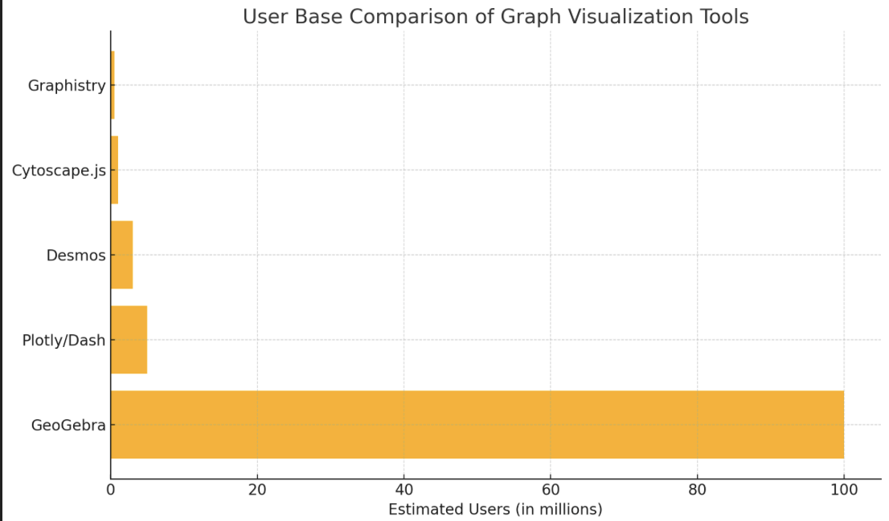

# Concept

The Graph Website project is a website with a graphical user interface (GUI), which is an interactive platform designed to enable users to create, manipulate, and visualize graphs seamlessly. It is accessible through any browser, and users can generate one or two graphs at the same time, allowing for comparative analysis.

---

## Idea

This website is developed for:

1. **Students** who want to have a better understanding, for example, of mathematical concepts.
2. **Educators** who want to show visualizations while teaching, especially in the fields of mathematics, economics, and others.

---

## Features

1. **Two input fields** where the user inputs mathematical equations.  
2. **Plot Graph** feature to generate the corresponding graph.

---

## Use Case 1: Plotting Mathematical Equations

- **Actors**: User  
- **Description**: Users can input mathematical equations and visualize their graphical representations.

**Main Flow**:
1. The user opens the Graph Project web application.
2. The user inputs a mathematical equation in the designated input field.
3. The user specifies the range for the X and Y axes.
4. The user submits the input to generate the graph.
5. The application processes the input and displays the corresponding graph in real-time.
6. The user has the option to modify the equation, or the axis ranges to see changes reflected in the graph.

---

## Market Analysis

Before launching the website, a market analysis was conducted to understand the key competitors in the market:

- Desmos  
- GeoGebra  
- Cytoscape.js  
- Graphistry  
- Plotly/Dash  

**User Base Comparison:**

---

## Cost Analysis

The website will be free to use, in line with many of the key players in the market. Our **business model** is a **freemium, advertising-based model**, where revenue is generated through ad impressions and clicks.

### Revenue Estimation:

- **Daily Active Users (DAU)**: ~8,000 users (on average)  
- **Monthly Ad Impressions**: 8,000 users × 3 ads × 30 days = **720,000**
- **Average CPM (Cost per 1,000 impressions)**: €3  
- **Click Through Rate (CTR)**: 4%  
- **Estimated Clicks**: 28,800  
- **Average CPC (Cost per Click)**: €0.30  

**Monthly Revenue** = 28,800 × €0.30 = **€8,640/month**  
**Yearly Revenue** = €8,640 × 12 = **€103,680**

---

## Summary Table: Annual Costs

| Category                  | Estimated Annual Cost |
|---------------------------|------------------------|
| Backend Hosting           | €10,000               |
| Cloud Storage             | €20,000               |
| Domain                    | €20                   |
| Development & Maintenance | €25,000              |
| Marketing                 | €30,000               |
| Customer Support          | €12,000               |
| **Total Estimate**        | **€97,020**          |

---

## Profit

| Metric                    | Amount     |
|---------------------------|------------|
| **Total Revenue**         | €103,680   |
| **Total Expenses**        | €97,020    |
| **Taxes (15% on profit)** | €999       |
| **Net Profit**            | **€5,661** |

---

## Market Release and Strategy: Focus on the Italian Market

The Graph Website will initially launch in **Italy**, targeting high school and university students, educators, and individuals with a strong interest in mathematics and data visualization.

### Key Market Trends in Italy

- The **Italian EdTech market is expanding** as schools integrate more digital tools.
- There's growing **interest in personalized learning** and interactive platforms, especially post-pandemic.
- **Government initiatives** to digitize education are providing more opportunities for growth and partnerships.

---
