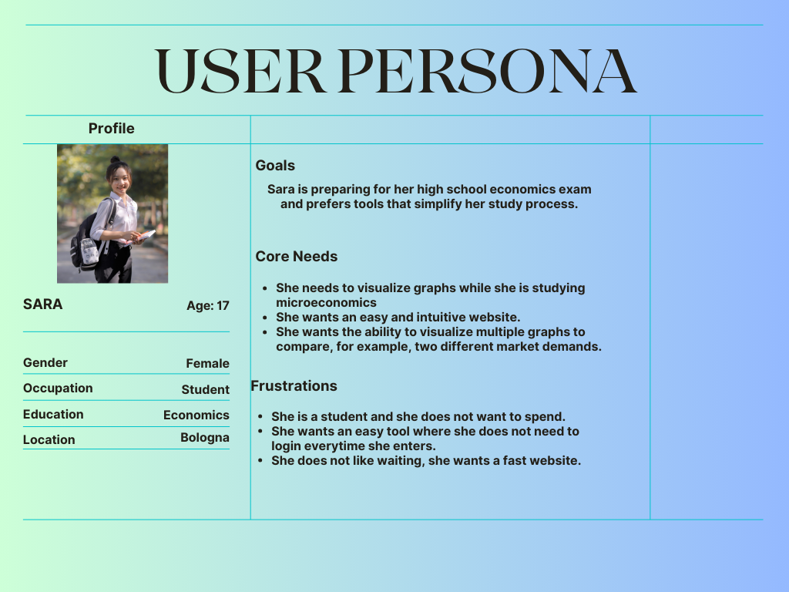

# Requirements

## Functional Requirements
- **Representation**: Users should be able to input one or two mathematical equations and visualize their graphical representations.
    - **Acceptance Criteria**: The system must allow users to input equations (e.g., y = x^2) and specify X and Y ranges. The corresponding graph should be generated within a few seconds upon submission.
- **Multiple Graphing Capability**: Users can create one or two graphs simultaneously for comparative analysis.
    - **Acceptance Criteria**:  The user interface should allow users to input and visualize two different equations side by side, clearly displaying both graphs with distinct colors or styles.
- **Static Graph Updates**:Users can modify equations and axis ranges, but the graphs will refresh only after the user submits the new inputs.
    - **Acceptance Criteria**: Changes made to the input fields should require a submit action to generate and display the updated graphs.
-**User Interface**:The application must provide an intuitive and user-friendly interface for both graph input and visualization.
    - **Acceptance Criteria**:  Users should find the interface straightforward.

## Non-Functional Requirements

### 1. Performance
- **Requirement**: The application must handle concurrent users and maintain responsiveness during peak usage.
- **Acceptance Criteria**: The system should respond to user actions within **2 seconds** under normal load and within **5 seconds** under high load (e.g., 100+ concurrent users).

### 2. Security
- **Requirement**: The system must be protected against common vulnerabilities (e.g., XSS, CSRF).
- **Acceptance Criteria**:
  - Use secure HTTP headers (e.g., `Content-Security-Policy`, `X-Frame-Options`).
  - Sanitize all user inputs before processing or rendering.
  - Limit external API exposure and block unauthorized access to endpoints.

### 3. Reliability
- **Requirement**: The application should be stable, with minimal downtime.
- **Acceptance Criteria**:
  - System availability should be **99.5%** or higher.
  - Errors must be logged, and crashes must not interrupt core functionalities.
  - Server restarts should preserve data and session continuity (if sessions are used).

### 4. Scalability
- **Requirement**: The system should be able to scale to accommodate future user growth.
- **Acceptance Criteria**:
  - The architecture should support horizontal scaling.
  - Backend components (e.g., graph rendering logic) should be modular and distributable.

### 5. Maintainability
- **Requirement**: Code should be easy to maintain and extend.
- **Acceptance Criteria**:
  - Code should follow standard style guides (linted).
  - Tests must cover core functions (e.g., API responses, graph output).
  - Use of CI/CD to ensure safe and automated deployments.

## Implementation Requirements

- **Backend Development**: The backend should be developed using Node.js and Express to handle graph generation requests and manage user inputs effectively.
    - **Acceptance Criteria**: The API should be designed to process user inputs for equations and range specifications, returning the necessary data to generate the graphs. The backend should be able to serve the static files required for the frontend and facilitate any necessary data handling.
- **Frontend Development**: Utilize HTML, CSS, and JavaScript to create a responsive web application that interacts with the backend seamlessly.
    - **Acceptance Criteria**: The frontend should allow users to input equations and customize graph settings easily. It should dynamically display graphs using a graphing library like Plotly.js, enabling users to visualize their equations.
- **Graphing Library**: Implement a graphing library (e.g., Plotly.js) to render graphs based on user inputs.
    - **Acceptance Criteria**: The library should effectively display mathematical functions and allow customization of graph properties (e.g., color, scale, axis labels). The graphs should update upon user submission without requiring page reloads.
- **Publishing**: The Graph Website package should be published on npm to allow users to install and utilize the tool easily.
    - **Acceptance Criteria**: The package should include clear documentation on installation and usage, making it easy for developers and users to integrate the tool into their projects.

 **notes:** I added the implementation requirements as they are required for this course even though it is usually a management requirement. 

## User Stories

**For Students and Learners**

As a high school student, I want to plot mathematical graphs by entering equations so that I can better understand algebra and functions visually.
As a university student, I want to compare two graphs side by side so that I can analyze their intersections and behavior differences.
As a non-technical learner, I want a simple and intuitive interface so that I don’t need prior coding knowledge to use the tool.

**For Educators**

As a teacher, I want to create and share graph visualizations in class so that I can explain math concepts more interactively.
As an instructor, I want to show how graphs change in real time when modifying an equation so that I can demonstrate cause-effect relationships clearly.

**Example User Persona**

